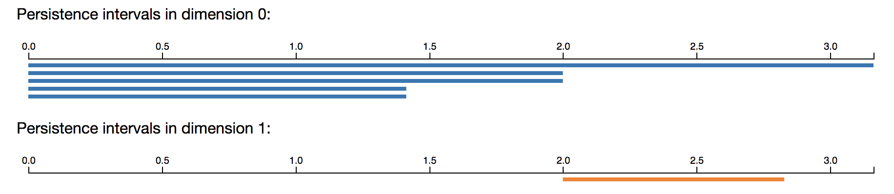
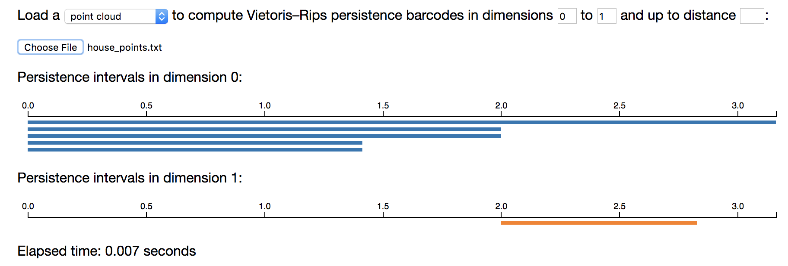
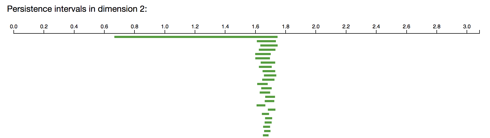
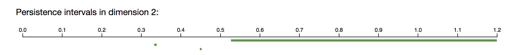
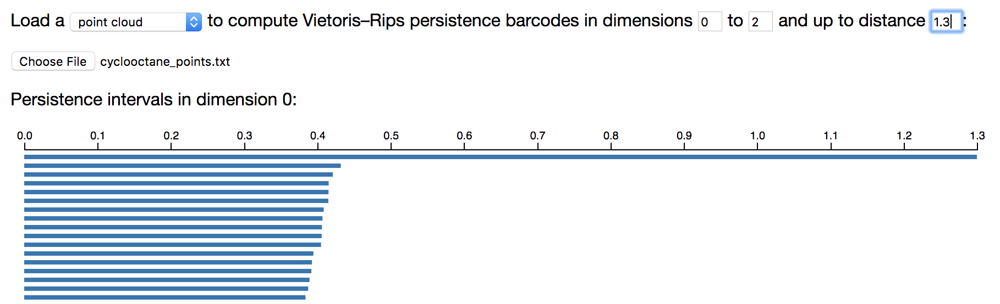
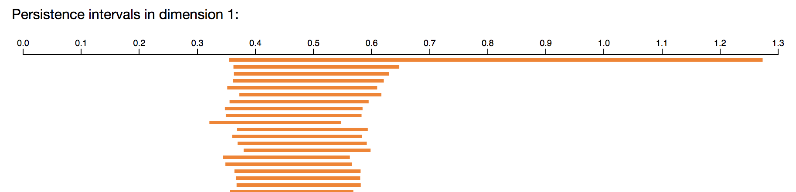
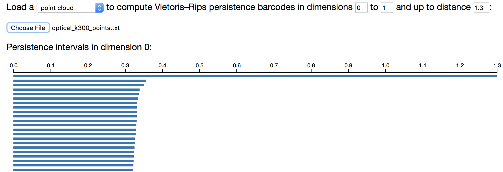
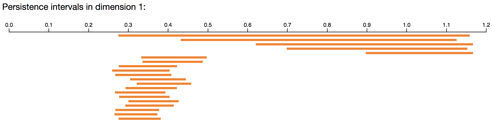

# Persistent Homology Tutorial

## Introduction

This tutorial accompanies the chapter on Toplogical Data Analysis in the book
[Data Science for Mathematicians](https://ds4m.github.io).

The tutorial uses code from [Ripser](https://github.com/Ripser/ripser)
by Ulrich Bauer (Bauer, 2015) and a variety of other places,
referenced throughout the text.

The first section of this tutorial (Persistent homology)
requires no software download.
However, you do need to download some datasets, which you can get from
[this folder in the book's GitHub repository](https://github.com/ds4m/ds4m.github.io/tree/master/chapter-10-resources/).

## Persistent homology

You can get the PDF slides for Henry's introduction to persistent homology
[here](https://www.math.colostate.edu/~adams/talks/AnIntroductionToAppliedTopology_Slides_3parts.pdf).

We will be using [Ripser](https://github.com/Ripser/ripser) in this tutorial.
Some slides about how Ripser works are available
[here](http://ulrich-bauer.org/ripser-talk.pdf).

### Ripser in your browser - synthetic examples

The easiest way to run Ripser is in a live demo in your browser, for which no
installation (and in particular, no Python) is required.
[Try it out!](http://live.ripser.org/).

#### House example - distance matrix

For example, we can use Ripser to compute the persistent homology of the
Vietoris-Rips complex of the following 5 points in the plane.


The distance matrix for these five points can be downloaded
[here](https://github.com/ds4m/ds4m.github.io/tree/master/chapter-10-resources/distance_matrices/house_distances.txt).
It contains the 5x5 distance matrix corresponding to the collection of 5
points in the plane shown above.  The contents of the file are as follows.

```
0, 2.0000, 2.8284, 2.0000, 3.1623
2.0000, 0, 2.0000, 2.8284, 3.1623
2.8284, 2.0000, 0, 2.0000, 1.4142
2.0000, 2.8482, 2.0000, 0, 1.4142
3.1623, 3.1623, 1.4142, 1.4142, 0
```

At the Ripser live webpage, enter the following input (including choosing to
upload that distance matrix file, as shown).


Ripser should give the following output in your browser.



Note that the 5 connected components merge into one,
with merging events happening at scales $\sqrt 2$ and 2.
There is a single 1-dimensional feature, beginning at scale parameter 2 and
ending at scale parameter $\sqrt 8$.

#### House example - point cloud

Instead of loading a distance matrix, it is also possible to to load in a set
of points in Euclidean space, listed by their Euclidean coordinates. See, for
example, [this file](https://github.com/ds4m/ds4m.github.io/tree/master/chapter-10-resources/point_clouds/house_points.txt).
It is the $5\times2$ matrix corresponding to the same collection of 5 points
in the plane. To input a point cloud in Ripser live, simply select the option
"point cloud" instead of "distance matrix."
You will get the same output as above!



#### Torus example

The following example computes the persistent homology barcodes of a
$20\times20$ grid of 400 points on the unit torus $S^1\times S^1$ in
$\mathbb{R}^4$, where a small amount of noise has been added to each point.
You can download the point cloud data file [here](https://github.com/ds4m/ds4m.github.io/tree/master/chapter-10-resources/point_clouds/torus_points.txt).
Only a subset of the intervals are shown below.




Note that the long barcodes (roughly between scale parameter 0.7 and 1.5)
recover the homology of the torus, with a single connected component, with
two 1-dimensional holes, and with a single 2-dimensional hole.

#### Sphere example, with a Python script to create the points

A set of points sampled uniformly at random from the unit sphere can be
downloaded [here](https://github.com/ds4m/ds4m.github.io/tree/master/chapter-10-resources/point_clouds/sphere_points.txt).  But you don't have to use that
particular set of randomly generated points.  You can generate your own, as
follows.

Download and run the Python script
[sphere_points.py](https://github.com/ds4m/ds4m.github.io/tree/master/chapter-10-resources/sphere_points.py).
It will sample 500 points from the unit sphere $S^2$ in $\mathbb{R}^3$,
and then save the point cloud to a text file named `sphere_points.txt`.
(If you have downloaded the entire code repository, you may want to move that
file into the `point_clouds` folder.)

We can compute the persistent homology barcodes in Ripser. So that the
computation finishes, we have asked Ripser to compute only up to scale
parameter 1.2. (One can compute larger examples after downloading Ripser to
one's machine, as in a later section.) Only a subset of the intervals are shown
below.




Note that the long barcodes (roughly between scale parameter 0.55 and 1.2)
recover the homology of the 2-sphere, with a single connected component,
no 1-dimensional holes, and a single 2-dimensional hole.

### Ripser in your browser - cyclooctane data

This is an example with a real dataset of cyclooctane molecule conformations.


The cyclooctane molecule consists of a ring of 8 carbon atoms (shown in black),
each bonded to a pair of hydrogen atoms (shown in white).

The cyclooctane molecule C<sub>8</sub>H<sub>16</sub> consists of a ring of 8
carbons atoms, each bonded to a pair of hydrogen atoms. A conformation of this
molecule is a chemically and physically possible realization in 3D space,
modulo translations and rotations. The locations of the carbon atoms in a
conformation determine the locations of the hydrogen atoms via energy
minimization, and hence each molecule conformation can be mapped to a point in
$\mathbb{R}^{24}=\mathbb{R}^{8\times3}$, as there are eight carbon atoms in the
molecule and each carbon location is represented by three coordinates $x,y,z$.
This map realizes the conformation space of  cyclooctane as a subset of
$\mathbb{R}^{24}$.

It turns out that the conformation space is a two-dimensional stratefied space,
i.e., a two-dimensional manifold with singularities.  Furthermore, Brown et al.
(2008), Martin et al. (2010), and Martin and Watson (2011) show that the
conformation space of  cyclooctane is the union of a sphere with a Klein
bottle, glued together along two circles of singularities.  (See Chapter 10 of
[Data Science for Mathematicians](https://ds4m.github.io/) for more detail, or
Figures 7 and 8 in Martin and Watson (2011).) Indeed, the algorithm they
develop allows them to triangulate this conformation space from a finite
sample.

Zomorodian (2012) uses the cyclooctane dataset as an example to show that we
can efficiently recover the homology groups of the conformation space using
persistent homology. In this section we essentially follow Zomorodian's
example. We begin with a sample of 1,000 points on the conformation space.
(This data is publicly available at [Shawn Martin's webpage](http://www.sandia.gov/~smartin/software.html).)
We then compute the resulting persistent homology. We obtain the Betti numbers
$b_0=b_1=1$ and $b_2=2$, which match the homology groups of the union of a
sphere with a Klein bottle, glued together along two circles of singularities.

The following example computes the persistent homology barcodes of 1,000 points
from the configuration space of cyclooctane molecules in $\mathbb{R}^{24}$.
This dataset is available [here](https://github.com/ds4m/ds4m.github.io/tree/master/chapter-10-resources/point_clouds/cyclooctane_points.txt).

So that the computation finishes, we have asked Ripser to compute only up to
scale parameter 1.3. (One can compute larger examples after downloading Ripser
to one's machine, as in a later section.) Only a subset of the intervals are
shown below.






The long barcodes (roughly between scale parameter 0.65 and 1.25), with one
connected component, one 1-dimensional hole, and two 2-dimensional holes, match
the homology of the union of a sphere with a Klein bottle, glued together along
two circles of singularities.

### Ripser in your browser - optical image patch data

This is an example with a real dataset of optical image patch data.

The optical image database collected by van Hateren and van der Schaaf (1998)
contains black and white digital photographs from a variety of indoor and
outdoor scenes. Lee et al. (2003) study $3\times3$ patches from these images,
and Carlsson et al. (2008) continue the analysis of image patches using
persistent homology. Carlsson et al. (2008) begin with a large collection of
high-contrast, normalized $3\times3$ pixel patches, each thought of as a point
in $\mathbb{R}^9$. They change to the Discrete Cosine Transform (DCT) basis,
which maps the patches to the unit sphere $S^7$ in $\mathbb{R}^8$.  They select
from this space the 30% densest vectors, where density is based on the distance
from a point to its 300th nearest neighbor. In Carlsson et al.  (2008), this
dense core subset is denoted $X(300,30)$. In the next example we verify the
result from Carlsson et al. (2008): $X(300,30)$ has the topology of a circle.

The following example computes the persistent homology barcodes of 1,000 points
from $X(300,30)$.
The dataset can be downloaded [here](https://github.com/ds4m/ds4m.github.io/tree/master/chapter-10-resources/point_clouds/optical_k300_points.txt).

So that the computation finishes, we have asked Ripser to compute only up to
scale parameter 1.3. (One can compute larger examples after downloading Ripser
to one's machine, as in a later section.) Only a subset of the intervals are
shown below.




The long barcodes (roughly between scale parameter 0.5 and 1.25), with one
connected component and one 1-dimensional hole, have the homology of a circle.
This is good evidence that the core subset $X(300,30)$ is well-approximated by
a circle. 

We plot the projection of these points onto the first two linear gradient
Discrete Cosine Transform basis vectors.


The projection of $X(300,30)$ above shows a circle. It is called the optical
primary circle and is parameterized as shown below.


We can also consider the 3-circle model, which arises from the dataset
$X(15,30)$ that corresponds to a more local estimate of density.
The dataset can be downloaded [here](https://github.com/ds4m/ds4m.github.io/tree/master/chapter-10-resources/point_clouds/optical_k15_points.txt).

So that the computation finishes, we select only 1,000 points from $X(15,30)$,
and we have asked Ripser to compute only up to scale parameter 1.2. (One can
compute larger examples after downloading Ripser to one's machine, as in a
later section.) Only a subset of the intervals are shown below.




The barcodes with one connected component and five 1-dimensional holes
correspond to the 3-circle model for the core subset $X(15,30)$. Much more
convincing (longer) intervals can be obtained by using more points and
computing with Ripser downloaded to your local machine.

We plot the projection of these points onto the first two linear gradient
Discrete Cosine Transform basis vectors.


The corresponding three-circle model for optical images is shown below.


### Exercises on persistent homology

**Exercise**: Write a script (say in Python, or some other language) that
selects 400 points uniformly at random (or approximately uniformly at random)
from the annulus
$$ \left\\{ (x,y)\mid 0.95^2\leq x^2+y^2\leq1.05^2 \right\\} $$
in $\mathbb{R}^2$. Compute its persistent homology barcodes using Ripser.

**Exercise**: Write a script (say in Python, or some other language) that
selects 400 points uniformly at random (or approximately uniformly at random)
from the "coconut shell"
$$ \left\\{ (x,y,z) \mid 0.95^2\leq x^2+y^2+z^2\leq 1.05^2 \right\\} $$
in $\mathbb{R}^3$. Compute its persistent homology barcodes using Ripser.

**Exercise**: Write a Python script (or code in some other language) that will
select $n$ evenly-spaced points from the unit circle in the plane. Compute the
persistent homology of the Vietoris-Rips complex of 4, 6, 9, 12, 15, and 20
equally spaced points on the circle.
Do you get ever homology above dimension 1?

**Exercise**: Find a planar dataset $Z$ in $\mathbb{R}^2$ and a filtration
value $t$ such that $VR(Z,t)$ has nonzero Betti number $b_2$. Do a computation
in Ripser to confirm your answer. 

**Exercise**: Find a planar dataset $Z$ in $\mathbb{R}^2$ and a filtration
value $t$ such that $VR(Z,t)$ has nonzero Betti number $b_6$. Do a computation
in Ripser to confirm your answer. 

**Exercise**: Let $X$ be the 8 vertices of the cube in $\mathbb{R}^3$,
$X=\{(\pm 1,\pm 1,\pm 1)\}$.  Equip $X$ with the Euclidean metric.
Compute the persistent homology of the Vietoris-Rips complex of $X$.
Do you get ever homology above dimension 2?

**Exercise**: One way to produce a torus is to take a square $[0, 1] \times [0,
1]$ and then identify opposite sides. This is called a flat torus. More
explicitly, the flat torus is the quotient space $([0, 1] \times [0, 1]) /
\sim$, where $(0, y) \sim (1, y)$ for all $y$ in $[0, 1]$ and where $(x, 0)
\sim (x, 1)$ for all $x$ in $[0, 1]$.  The Euclidean metric on $[0, 1] \times
[0, 1]$ induces a metric on the flat torus.  For example, in the induced metric
on the flat torus, the distance between $(0, 1/2)$ and $(1, 1/2)$ is zero,
since these two points are identified. The distance between $(1/10, 1/2)$ and
$(9/10, 1/2)$ is $2/10$, by passing through the point $(0, 1/2) \sim (1, 1/2)$.

Write a Python script (or code in another language) that selects 400 random
points from the square $[0, 1] \times [0, 1]$ and then computes the
$400\times400$ distance matrix for these points under the induced metric on the
flat torus.  Use Ripser to compute the persistent homology of this metric
space.

**Exercise**: One way to produce a Klein bottle is to take a square $[0, 1]
\times [0, 1]$ and then identify opposite edges, with the left and right sides
identified with a twist. This is called a flat Klein bottle. More explicitly,
the flat Klein bottle is the quotient space $([0, 1] \times [0, 1]) / \sim$,
where $(0, y) \sim (1, 1 - y)$ for all $y$ in $[0, 1]$ and where $(x, 0) \sim
(x, 1)$ for all $x$ in $[0, 1]$. The Euclidean metric on $[0, 1] \times [0, 1]$
induces a metric on the flat Klein bottle. For example, in the induced metric
on the flat Klein bottle, the distance between $(0, 4/10)$ and $(1, 6/10)$ is
zero, since these two points are identified. The distance between $(1/10,
4/10)$ and $(9/10, 6/10)$ is $2/10$, by passing through the point $(0, 4/10)
\sim (1, 6/10)$.

Write a Python script (or code in another language) that selects 400 random
points from the square $[0, 1] \times [0, 1]$ and then computes the
$400\times400$ distance matrix for these points under the induced metric on the
flat Klein bottle. Use Ripser to compute the persistent homology of this metric
space.

If you have Ripser installed on your local machine, change to
$\mathbb{Z}/3\mathbb{Z}$ coefficients and see how the persistent homology
changes.

**Exercise**: One way to produce a projective plane is to take the unit sphere
$S^2$ in $\mathbb{R}^3$ and then identify antipodal points. More explicitly,
the projective plane is the quotient space $S^2 / (x \sim -x)$. The Euclidean
metric on $S^2$ induces a metric on the projective plane.

Write a Python script (or code in another language)  that selects 400 random
points from the unit sphere $S^2$ in $\mathbb{R}^3$ and then computes the
$400\times400$ distance matrix for these points under the induced metric on the
projective plane. Use Ripser to compute the persistent homology of this metric
space.

If you have Ripser installed on your local machine, change to
$\mathbb{Z}/3\mathbb{Z}$ coefficients and see how the persistent homology
changes.


### Ripser on your machine

A more advanced (but very useful) step is to now download Ripser to your
machine and to run it locally. This allows you to perform larger computations.
Ripser is written in C++. You may download the code for Ripser
[here](https://github.com/Ripser/ripser), which also contains installation
instructions. Minimal installation instructions are listed below

```
git clone https://github.com/Ripser/ripser.git
cd ripser
make all
./ripser examples/sphere_3_192.lower_distance_matrix
```

For convenience, you may want to download all of the data files from
[this folder](https://github.com/ds4m/ds4m.github.io/tree/master/chapter-10-resources/point_clouds/optical_k15_points.txt)
and copy the executable file `ripser` into that folder, then `cd` into the
same folder.

You can use the flag `--format distances` to specify you are computing on a
distance matrix, or `--format point-cloud` to specify you are computing on a
point cloud. The flag `--dim k` specifies that homology is computed only up to
dimension $k$, and the flag `--threshold t` specifies that persistent homology
is computed only up to scale parameter $t$. For example, we can recreate all of
the examples above with the following commands.

House example on the distance matrix:

```
./ripser --format distance distance_matrices/house_distances.txt
```

House example on the point cloud:

```
./ripser --format point-cloud point_clouds/house_points.txt
```

Torus example, up to 2-dimensional homology:

```
./ripser --format point-cloud --dim 2 point_clouds/torus_points.txt
```

Sphere example, up to scale parameter 1.2:

```
./ripser --format point-cloud --dim 2 --threshold 1.2 point_clouds/sphere_points.txt
```

Cyclooctane example. Try increasing the distance threshold gradually and see
if your computer can do better than Ripser in your browser:

```
./ripser --format point-cloud --dim 2 --threshold 1.3 point_clouds/cyclooctane_points.txt
```

Optical image patch example:

```
./ripser --format point-cloud --dim 1 --threshold 1.3 point_clouds/optical_k300_points.txt
```

Instead of just printing Ripser's output to the terminal, you can also save it
to a text file. The below example also saves the output to the text file
`house_points_ripser_printed.txt`.

```
./ripser --format point-cloud point_clouds/house_points.txt | tee -a house_points_ripser_printed.txt
```


## Python

The remainder of this tutorial requires one to have Python and/or the Ripser
software package installed. 

Installing and running new code can be frustrating, especially if it is in a
language (perhaps Python) that is unfamiliar to you. Nevertheless, we believe
that it is extremely important for all practitioners of machine learning to
have some exposure to Python. For this reason, the time you spend getting
Python running on your machine is time well spent, even though this can feel
like a frustrating investment of time.

If you don't yet have Python, and if you are a PC user, then we recommend
installing [Anaconda](https://www.anaconda.com/download). If you don't yet have
Python, and if you are a Mac user, then we recommend installing Python 2.7.15
from [here](https://www.python.org/downloads/release/python-2715/). We expect
the code to work with an existing version of Python that you may happen to have
already.


### Ripser with Python

Melissa McGuirl has written very nice code for using Ripser with Python, which
is what we will use in this section. In particular, the file
`house_points_ripser_printed.txt` that we saved in the section above is not in
a format that is terribly easy to work with. Melissa's code reformats Ripser
output in a convenient manner.

Alternatively, there is a Cython wrapper for Ripser available which might be
more efficient and better for non-Linux machines. The wrapper is available
[here](https://pypi.org/project/ripser/) or 
[here](https://ripser.scikit-tda.org/).

Ensure you are in the folder of data files mentioned
[above](#ripser-on-your-machine) and copy the Ripser executable into that
folder as suggested earlier.  (Or, alternatively, make sure that Ripser is in
your Python path, and then in line 45 of `getBarCodes.py`, change `./ripser` to
`ripser`). In your terminal, try running the following command.

```
python getBarCodes.py -i distance_matrices/ -o ripser_outputs/
```

This will take every distance matrix in the folder `distance_matrices`,
compute the persistent homology barcodes for the Vietoris-Rips complex built on
top of this metric space, and print the output barcodes to the folder
`ripser_outputs`.

The following command then separates the Ripser output into barcode intervals
separated by dimension.

```
python separateRipser.py -i ripser_outputs/ -o barcodes/
```

And the following command then plots the corresponding persistence diagrams in
your current directory.

```
python plotpd.py -i barcodes/ -o ./
```

Melissa's code is written to work only with input metric space data in the form
of a distance matrix, but one could edit it to also work with input metric
space data in the form of a point cloud, for example.


## Topological feature vectors - persistent homology and machine learning

There are by now a wide variety of ways to incorporate persistent homology
information into feature vectors for a machine learning task (Adcock et al
2016, Adams et al 2017, Atienza 2018, Bendich et al 2016, Bubenik 2015, Bubenik
& Dlotko 2016, Carriere et al 2015, Carriere & Bauer 2018, Carriere et al 2018,
Chazal & Divol 2018, Chen et al 2015, Chevyrev et al 2018, Chung et al 2009, Di
Fabio & Ferri 2015, Hofer et al 2017, Kalisnik 2018, Reininghaus et al 2015,
Skraba 2018, Topaz et al 2015, Zeppelzauer et al 2016). We tersely describe a
few of these approaches.

For Henry's "from persistent homology to machine learning" survey slides from
the ICERM TRIPODS bootcamp, please see
[here](http://www.math.colostate.edu/~adams/talks/PHtoML_Slides.pdf).

### Persistence landscpaes

One example is persistence landscapes (Bubenik 2015).  Bubenik & Dlotko (2017)
have [made their code
available](https://www.math.upenn.edu/~dlotko/persistenceLandscape.html), and
persistence landscapes are also [implementable in
R-TDA](https://rdrr.io/cran/TDA/man/landscape.html).

### Persistence images

A second example is persistence images (Adams et al 2017), with Python code
available from [Nathaniel Saul (Persims)](https://github.com/scikit-tda/persim
(Persims by Nathaniel Saul) or [Francis
Motta](https://gitlab.com/csu-tda/PersistenceImages), and with Matlab code
available [here](https://github.com/CSU-TDA/PersistenceImages).

We'll attempt to describe how to compute persistence images using the Jupyter
notebooks accompanying [Nathaniel Saul's Persim
code](https://github.com/scikit-tda/persim).  First, download the Persim code.
Second, install [Jupyter](http://jupyter.org/install.html), perhaps using
Anaconda as described in that link. Open a new terminal (which is often
required after new installations) and in that terminal, try the following
command.

```
jupyter notebook
```

This should open a window in an internet browser. In this browser window,
change directories to `persim/notebooks`, and then open the Jupyter notebook
`Persistence Images.ipynb`. You should then be able to run the code in the
browser!

## Topological feature vectors - coding challenges

### 6 shape classes

Change directory to the folder
`topological-data-analysis/topological-feature-vectors/data-6-shape-classes`.
<font color='red'>NOTE: Folder missing--must fix!</font>
This subfolder contains persistence diagram data for 6 shape classes:

 1. A unit cube
 2. A circle of diameter one
 3. A sphere of diameter one
 4. Three clusters with centers randomly chosen in the unit cube
 5. Three clusters within three clusters
 6. A torus with a major diameter of one and a minor diameter of one half.

These shape classes are described in Section 6.1 of the paper [Persistence
Images: A Stable Vector Representation of Persistent
Homology](http://jmlr.org/papers/v18/16-337.html), and are shown below.


We produced 25 point clouds of 500 randomly sampled points from each shape
class. We then added a level of Gaussian noise to each point, at a noise level
neta=0.1 or neta=0.05. We then have already computed the persistent homology
intervals in homological dimension i=0 and i=1. <font color='red'>Should "neta" here be "eta" (Greek letter)?  If so, we can then use MathJax on these equations.</font>

For example, the file `ToyData_PD_n05_23_6_0.txt` corresponds to noise level
neta=0.05, the 23rd point cloud randomly sampled from shape class 6., with
persistent homology computed in dimension 0. Each row of this file has two
entries: the birth and death time of a 0-dimensional persistent homology
interval.

By contrast, the file `ToyData_PD_n1_21_3_1.txt` corresponds to noise level
neta=1, the 21st point cloud randomly sampled from shape class 3., with
persistent homology computed in dimension 1. Each row of this file has two
entries: the birth and death time of a 1-dimensional persistent homology
interval.

Your task is to use machine learning to distinguish these six classes from each
other. In a K-medoids clustering test, some accuracies and computation times
are displayed for bottleneck distances, Wasserstein distances, persistence
landscapes, and persistence images in Table 1 of [Persistence Images: A Stable
Vector Representation of Persistent
Homology](http://jmlr.org/papers/v18/16-337.html).  Do you have ideas for
beating these accuracies or computation times?


In the above table, PD means the persistence diagram equipped with either the
$L^1$ (1-Wasserstein), $L^2$ (2-Wasserstein), or sup (bottleneck) metrics. PL
means the persistence landscape, equipped with either the $L^1$, $L^2$, or sup
metric. PI means the persistence image, equipped with either the $L^1$, $L^2$,
or sup metric. But you should develop your own techniques for turning barcodes
into feature vectors, and see how they compare!

Some Matlab code for creating points from these shape classes is available
[here](https://github.com/CSU-TDA/PersistenceImages/tree/master/matlab_code/sixShapeClasses).


## Bibliography

A. Adcock, E. Carlsson, and G. Carlsson. The ring of algebraic functions on
persistence bar codes. _Homology, Homotopy and Applications_, 18:381-402, 2016

H. Adams, S. Chepushtanova, T. Emerson, E. Hanson, M. Kirby, F. Motta, R.
Neville, C. Peterson, P. Shipman, and L. Ziegelmeier. Persistence images: A
stable vector representation of persistent homology. _Journal of Machine
Learning Research_, 18:1-35, 2017.

P. Bendich, J.S. Marron, E. Miller, A. Pieloch, and S. Skwerer, Persistent
homology analysis of brain artery trees. _Ann. Appl. Stat._, 10:198-218, 2016.

M. A. Armstrong. _Basic Topology_. Springer, New York, Berlin, 1983.

N. Atienza, R. Gonzalez-Diaz, and M. Soriano-Trigueros. On the stability of
persistent entropy and new summary functions for topological data analysis.
arXiv:1803.08304, 2018.

U. Bauer. Ripser: A lean C++ code for the computation of Vietoris-Rips
persistence barcodes. Software available at https://github.com/Ripser/ripser,
2015.

M. W. Brown, S. Martin, S. N. Pollock, E. A. Coutsias, and J. P. Watson.
Algorithmic dimensionality reduction for molecular structure analysis. _Journal
of Chemical Physics_, 129:064118, 2008.

P. Bubenik. Statistical topological data analysis using persistence landscapes.
_Journal of Machine Learning Research_, 16:77-10, 2015.

P. Bubenik and P. Dlotko, A persistence lanscapes toolbox for topological
statistics. _Journal of Symbolic Computation_, 78:91-114, 2017.

G. Carlson, T. Ishkhanov, V. de Silva, and A. Zomorodian. On the local behavior
of spaces of natural images. _Int. J. Computer Vision_, 76:1-12, 2008.

M. Carriere, U. Bauer. On the metric distortion of embedding persistence
diagrams into reproducing kernel Hilbert spaces. arXiv:1806.06924, 2018

M. Carriere, M. Cuturi, and S. Oudot. Sliced Wasserstein kernel for persistence
diagrams. arXiv:1706.03358, 2017.

M. Carriere, S. Oudot, and M. Ovsjanikov. Stable topological signatures for
points on 3d shapes. In _Computer Graphics Forum_, 34:1-2, 2015.

Y.-C. Chen, D. Wong, A. Rinaldo, and L. Wasserman. Statistical analysis of
persistence intensity functions. arXiv:1510.02502, 2015.

L. Crawford, A. Monod, A. X. Chen, S. Mukherjee, and R. Rabadan. Functional
data analysis using a topological summary statistic: The smooth Euler
characteristic transform. arXiv: https://arxiv.org/abs/1611.06818, 2017.

F. Chazal, V. de Silva, and S. Oudot. Persistence stability for geometric
complexes. _Geometriae Dedicata_, pages 1-22, 2013.

F. Chazal and V. Divol. The density of expected persistence diagrams and its
kernel based estimation. arXiv:1802.10457, 2018.

I. Chevyrev, V. Nanda, H. Oberhauser. Persistence paths and signature features
in topological data analysis. arXiv:1806.00381, 2018.

M.K. Chung, P. Bubenik, and P.T. Kim. Persistence diagrams of cortical surface
data. In _Information Processing in Medical Imaging_, 386-297, Springer, 2009.

B. Di Fabio and M. Ferri. Comparing persistence diagrams through complex
vectors. In _International Conference on Image Analysis and Processing_, LNCS
9279, pages 294-305, 2015.

H. Edelsbrunner and J. Harer. _Computational Topology: An Introduction_.
American Mathematical Society, Providence, 2010.

H. Edelsbrunner, D. Letscher, and A. Zomorodian. Topological persistence and
simplification. _Discrete Comput. Geom._, 28:511-533, 2002.

A. Hatcher. _Algebraic Topology_. Cambridge University Press, Cambridge, 2002.

C. Hofer, R. Kwit, M. Niethammer, and A. Uhl. Deep learning with topological
signatures. In _Advances in Neural Information Processing Systems_, pages
1634-1644, 2017.

S. Kalisnik. Tropical coordinates on the space of persistence barcodes. In
_Foundations of Computational Mathematics_, pages 1-29, 2018.

A. B. Lee, K. S. Pedersen, and D. Mumford. The nonlinear statistics of
high-contrast patches in natural images. _Int. J. Comput. Vision_, 54:83-103,
2003.

S. Martin and J. P. Watson. Non-manifold surface reconstruction from
high-dimensional point cloud data. _Computational Geometry_, 44:427-441, 2011.

S. Martin, A. Thompson, E. A. Coutsias, and J. P. Watson. Topology of
cyclo-octane energy landscape. _Journal of Chemical Physics_, 132: 234115,
2010.

J. Reininghaus, S. Huber, U. Bauer, and R. Kwitt. A stable multi-scale kernel
for topological machine learning. In _Proceedings of the IEEE Conference on
Computer Vision and Pattern Recognition_, pages 4741-4748, 2015.

P. Skraba. Persistent homology and machine learning. _Informatica_, 24(2),
2018.

C. Topaz, L. Ziegelmeier, and T. Halverson. Topological data analysis of
biological aggregation models. PloS One, 10(5):e0126383, 2015.

M. Zeppelzauer, B. Zielinski, M. Juda, and M. Seidl. Topological descriptors
for 3d surface analysis. In _Computational Topology in Image Context: 6th
International Workshop Proceedings_, pages 77-87, 2016.

J. H. van Hateren and A. van der Schaaf. Independent component filters of
natural images compared with simple cells in primary visual cortex. _Proc. R.
Soc. Lond. B_, 265:359-366, 1998.

A. Zomorodian. _Advances in Applied and Computational Topology_. American
Mathematical Society, 2012.

A. Zomorodian and G. Carlsson. Computing persistent homology. _Discrete Comput.
Geom_., 33:249-274, 2005.
